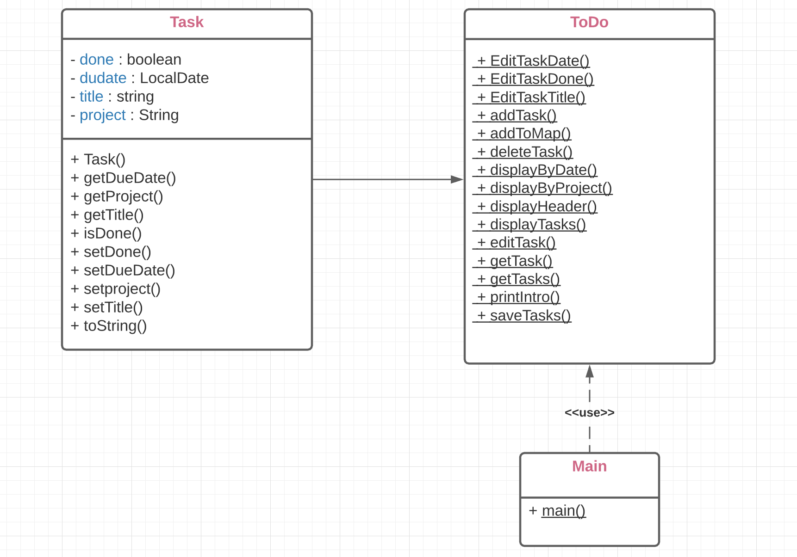
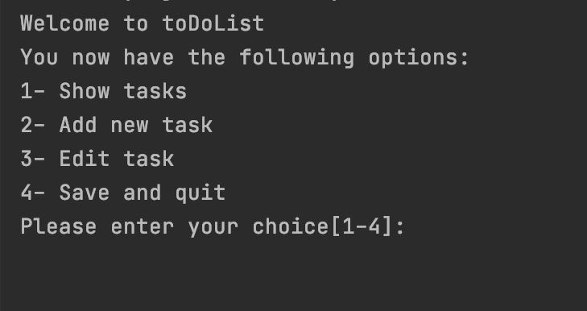
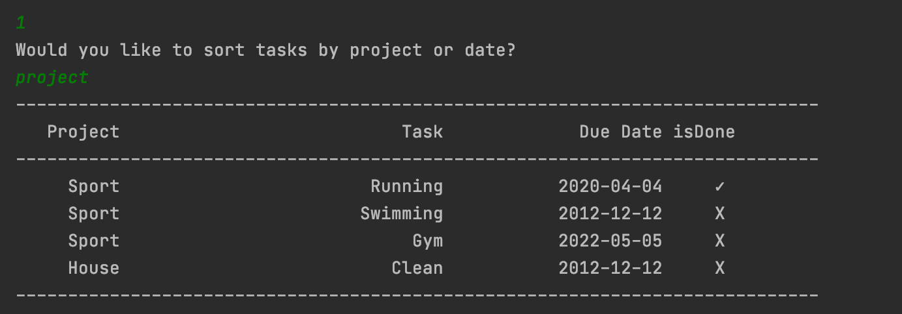
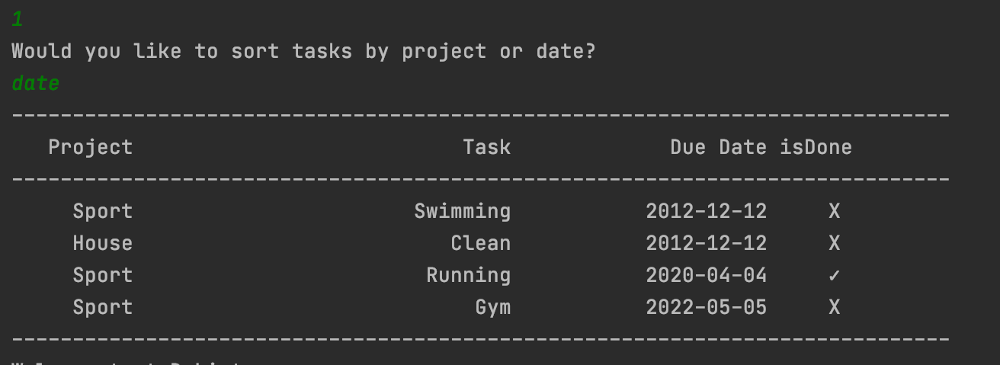
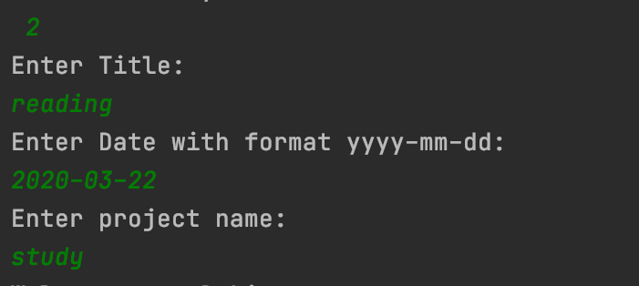

# ToDoList
This program is menu-driven. User will be presented with available options corresponding to selected menu. User will select an option from given choices and press ENTER key to move to next step. This program will save all tasks in the data file, therefore, next time when you open the program, it will resume its state.

# Basic features

## Models a task with:

-task title

-due date

-completion status

-project (if any)

## Display a collection of tasks that can be sorted

-by date

-by project

## Support the ability to
-add task

-edit task

-remove (delete) tasks

### Support a text-based user interface
### Load and save task list to data file

# Class Diagram

## Developers
- Makes use of a build tool.
- The headings on the readme are on now.
- Extracting methods from main into its own class.
- Test methods.
- Separate methods.
- Update diagram class.

## Usage
### Main menu
When user will run the program, main menu of the program will be shown to the user:

If user types number [1] and press ENTER key, the application will display the tasks inside the file sorted by project or by date.

If user types number [2] and press ENTER key, the application will prompt the user to enter the required fields of a task to add in the task list.

If user types number [3] and press ENTER key, the application will display the list of all previously saved tasks  and user has to select a task to perform any update, to mark as done or to remove.

If user types number [4] and press ENTER key, the application will save data and quit

# ToDoList